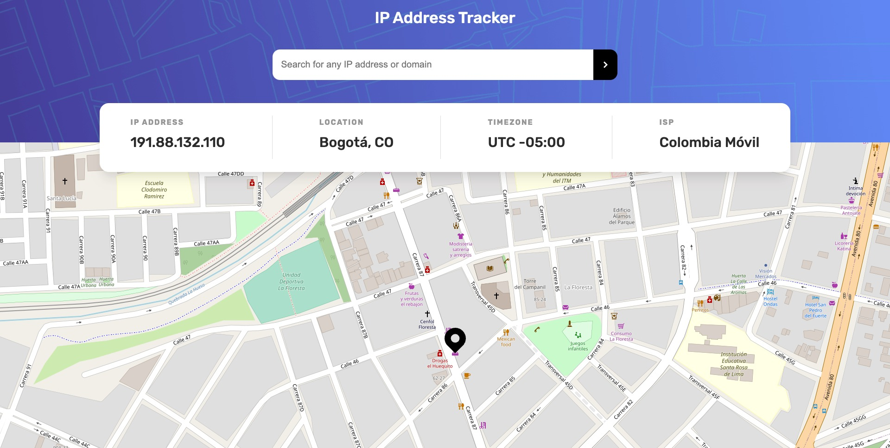
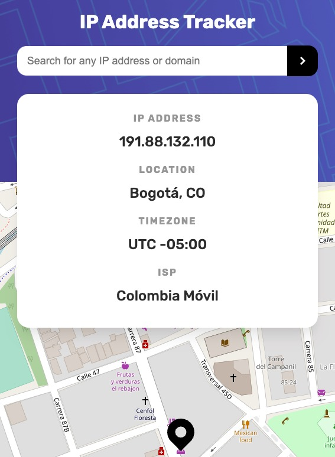

# Frontend Mentor - IP address tracker solution

This is a solution to the [IP address tracker challenge on Frontend Mentor](https://www.frontendmentor.io/challenges/ip-address-tracker-I8-0yYAH0). Frontend Mentor challenges help you improve your coding skills by building realistic projects. 

## Table of contents

- [Overview](#overview)
  - [The challenge](#the-challenge)
  - [Screenshot](#screenshot)
  - [Links](#links)
- [My process](#my-process)
  - [Built with](#built-with)
  - [What I learned](#what-i-learned)
  - [Continued development](#continued-development)
  - [Useful resources](#useful-resources)
- [Author](#author)

## Overview

### The challenge

Users should be able to:

- View the optimal layout for each page depending on their device's screen size
- See hover states for all interactive elements on the page
- See their own IP address on the map on the initial page load
- Search for any IP addresses or domains and see the key information and location

### Screenshot

Desktop view


Mobile view


### Links

- Solution URL: [Add solution URL here](https://your-solution-url.com)
- Live Site URL: [Add live site URL here](https://sofiaperezm.github.io/ip-address-tracker-master/)

## My process

### Built with

- HTML5 and CSS
- Mobile-first workflow
- Vanilla Javascript
- [Parcel JS](https://parceljs.org/) - Module bundler
- [LeafletJS](https://leafletjs.com/) - a JavaScript library
for interactive maps
- [Public IP Address API](https://www.ipify.org/)
- [IP Geolocation API by IPify](https://geo.ipify.org/)

### What I learned

I learned how to apply: 

- Async await syntax for enable asynchronous functions.
```js
async function init() {
    getUserPosition();
    const { ip } = await getInitialIP();
    const ipData = await getIPData(IP_ADDRESS_PARAM, ip);
    initInputSearch();
}
```

- Destructuring assignment syntax.
```js
function handleUserPosition(position) {
    const { latitude, longitude } = position.coords;
    initMap(latitude, longitude);
}
```

- Implement Leaflet JS library.


### Continued development

I would like to focus on implement React in my next challenge.  

### Useful resources

- [<input type="search">](https://developer.mozilla.org/en-US/docs/Web/HTML/Element/input/search) - This MDN Web Documentation for the input of type "search" helped me to take advantage of all the attributes that HTML has to offer. Also, it helped me to implement the corresponding aria-label.
- [HTMLElement: input event](https://developer.mozilla.org/en-US/docs/Web/API/HTMLElement/input_event) - This MDN Web Documentation helped me to understand better the event that `<input>` fires.
- [How to Use Fetch with async/await](https://dmitripavlutin.com/javascript-fetch-async-await/) - This amazing articule helped me to understand the API calls and the async-await syntax.
- [2.2 Geolocation Web API - Working with Data and APIs in JavaScript](https://www.youtube.com/watch?v=3ls013DBcww&ab_channel=TheCodingTrain) - This great video explains really well how to implement Geolocation Web API with navigator.geolocation. 

## Author

- Frontend Mentor - [@sofiaperezm](https://www.frontendmentor.io/profile/sofiaperezm)
- [Linkedin](https://www.linkedin.com/in/sofiaperezmantilla/)
